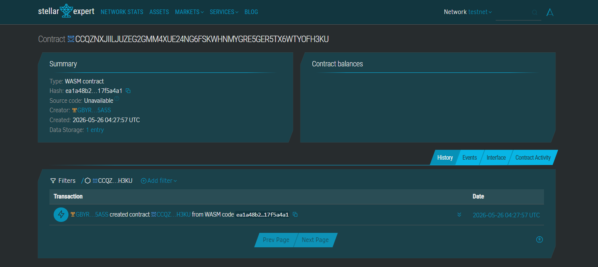

# Tindahan Connect

Tindahan Connect is a decentralized B2B supply chain payment routing protocol designed to link international OFW remittances directly with wholesale retail inventory systems in the Philippines.

### Problem & Solution
* **Problem:** Senders face high resource capital leakages back home when funding family micro-retail storefronts (sari-sari stores) because cash transfers are frequently redirected to general living consumption rather than business stock.
* **Solution:** Tindahan Connect ties digital value deposits directly to fast-moving consumer goods (FMCG) suppliers via Soroban contract state channels, ensuring financial capital converts seamlessly into physical stock inventory.

### Development Steps
* **Phase 1:** State lock lifecycle implementation, multisig authorization testing, and deployment scripts.
* **Phase 2:** Integration with distributed local supplier inventory tracking dashboards.

### Stellar Framework Advantages
* Native asset balance enforcement layers provide secure, transparent business execution parameters.
* Minimal transaction overheads make micro-stocking items highly cost-efficient.

### System Prerequisites
* Stable Rust Compiler (`rustc 1.75.0+`)
* Target Architecture Architecture: `wasm32-unknown-unknown`
* Soroban CLI Engine (`soroban-cli 21.0.0+`)

### Compilation & Operational Directives

### CONTRACT ID
Contract ID: CCQZNXJIILJUZEG2GMM4XUE24NG6FSKWHNMYGRE5GER5TX6WTYOFH3KU


#### 1. Compile Source Contract Logic
```bash
soroban contract build

2. Run Test Assertions
Bash
cargo test -- --nocapture

3. Testnet Network Smart Contract Deployment
Bash
soroban contract deploy \
  --wasm target/wasm32-unknown-unknown/release/tindahan_connect.wasm \
  --source-account my-ofw-key \
  --network testnet

Demonstration CLI Invocation Example
Bash
soroban contract invoke \
  --id CC...TINDAHAN_CONTRACT_ADDRESS... \
  --source-account ofw-hongkong-key \
  --network testnet \
  -- \
  setup_order \
  --ofw "GD...OFW_ADDRESS..." \
  --store_owner "GD...STORE_OWNER_ADDRESS..." \
  --distributor "GD...DISTRIBUTOR_SUPPLIER_ADDRESS..." \
  --token_addr "CB...USDC_ASSET_ADDRESS..." \
  --cost 300000000

License
This system tool is licensed under the open-source MIT License terms.
